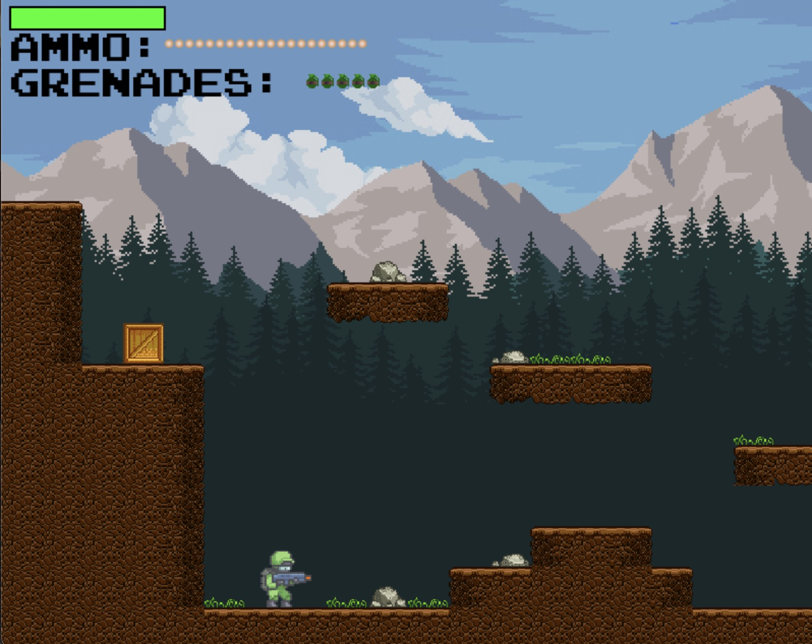

# 2D Shooting Game



This project is a 2D shooting game where players navigate a map, shoot enemies, and throw grenades. The game is inspired by the original code available at Shooter by russs123, with additional enhancements and features planned.

## 🎮 Game Overview

In this game, players control a character that can move, shoot enemies, and throw grenades to survive waves of attacks. The gameplay is simple yet challenging, with more features and improvements on the way!

### Controls:

Movement: Use the W, A, S, and D keys to move your character.

Shoot: Press the Space bar to shoot.

Grenade: Press the G key to throw a grenade.

## 📝 Game Rules:
Navigate through the 2D environment while avoiding and eliminating enemies.
The objective of the game is to reach the far right end of the map.

### Installation Steps:

1. **Clone the repository**:

2. **Create a virtual environment**:
   ```bash
   python -m venv .venv
   ```

3. **Activate the virtual environment**:
   ```bash
   source .venv/bin/activate
   ```

4. **Install the required packages**:
   ```bash
   pip install pygame
   ```

5. **Run the game**:
   ```bash
   python main.py
   ```

## 🚧 Upcoming Features:
The game is actively being developed, and here are some of the upcoming features to look forward to:

### Adjustable Difficulty Levels:

Players will be able to modify the difficulty settings (easy, medium, hard) based on their skill level.
Multiple 

### Levels:

More than one level will be available, each offering unique layouts, challenges, and enemy types.

### Level Editor:

Users will have the ability to create and customize their own levels, including:
Setting enemy positions.
Designing map layouts and obstacles.
Customizing enemy difficulty and behavior.
Stay tuned for updates!

## 🤝 Contributing


Contributions are welcome! If you'd like to add new features, fix bugs, or improve the code, feel free to submit a pull request. Please check out the contribution guidelines first.